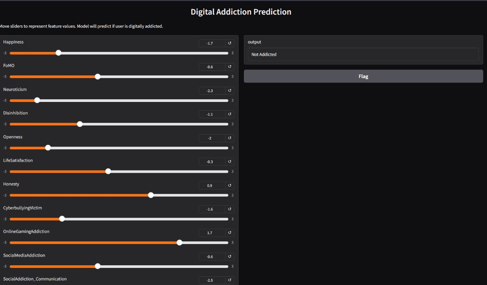

# Digital Addiction Prediction

This repository contains an end-to-end machine learning pipeline to predict **digital addiction** levels based on psychological and behavioral factors such as **FoMO (Fear of Missing Out), Neuroticism, Disinhibition, and Openness**.

---

## Web app design 
Test out the website here [Click link for website](https://veydant1811-digital-addiction-detector.hf.space/?__theme=system&deep_link=EeDcnUVrgbo)

Screenshot for gradio ui design is given below:


## Problem Definition

The rise in social media usage has led to a growing concern over its addictive effects, especially among youth and digitally active individuals. However, predicting and identifying individuals at high risk of social media addiction remains a complex task, given the influence of various psychological and behavioral traits.
This project aims to develop an interpretable machine learning model that can predict an individual's level of social media addiction using key psychological features such as Fear of Missing Out (FoMO), Neuroticism, Disinhibition, and Openness. By analyzing these factors, the goal is to uncover the most influential predictors, generate actionable insights, and support early interventions to improve digital well-being.

---

## Dataset
Checkout the dataset here: [digital-addiction-dataset](https://data.mendeley.com/datasets/6hhdxszm56/2)

It can be downloaded from the `/data` folder directly.
- **Source:** Self-reported psychological assessment dataset
- **Total Samples:** 495 participants
- **Features Include:**
  - **FoMO**
  - **Neuroticism**
  - **Disinhibition**
  - **Openness**
  - **Happiness**
  - **Life Satisfaction**
  - **Honesty**
  - **Cyberbullying Victim**
  - **Online Gaming Addiction**
  - **Social Media Addiction Subscores**: Communication, Problematic Use, Information Seeking

---

## Methodology

The project follows a **structured machine learning pipeline**:

1. **Data Collection & Preprocessing**
   - Renaming variables to English
   - Handling missing values
   - Feature scaling (standardization / normalization)
2. **Exploratory Data Analysis (EDA)**
   - Distribution plots
   - Correlation heatmaps
3. **Statistical Analysis**
   - T-tests and ANOVA for significance testing
4. **Model Training**
   - Random Forest
   - XGBoost
   - Support Vector Machine
   - Logistic Regression
   - LDA, QDA, DummyClassifier (baseline comparisons)
5. **Model Evaluation**
   - Confusion Matrix
   - Accuracy, Precision, Recall, F1
6. **Class Imbalance Handling**
   - SMOTE Oversampling
7. **Explainable AI**
   - SHAP (global feature importance)
   - LIME (local explanations)

---

## Notebooks

| Notebook | Description |
|------------|----------------|
| `1_data_cleaning+pre_processing.ipynb` | Raw data loading, cleaning, renaming |
| `2_eda.ipynb` | Visual EDA, transformation, statistcal tests |
| `3_model_building.ipynb` | Model training and saving for future use |
| `4_model_explainability.ipynb` | SHAP, LIME analysis |

---

## Results

| Model               | Accuracy | Precision | Recall | F1-Score |
|--------------------|----------|-----------|--------|----------|
| Decision Tree       | 1.00     | 1.00      | 1.00   | 1.00    |
| Random Forest       | 1.00     | 1.00      | 1.00   | 1.00     |
| XGBoost             | 1.00     | 1.00      | 1.00   | 1.00     |
| SVM                 | 0.89     | 0.89      | 0.95   | 0.92     |
| Logistic Regression | 0.91     | 0.91      | 1.00   | 0.95     |
| Linear Regression   | 0.89     | 0.89      | 1.00   | 0.94    |
| QDA                 | 0.92     | 0.92      | 1.00   | 0.96    |
| Dummy Classifier    | 0.89     | 0.89      | 1.00   | 0.94     |

**Decision Tree, Random forest & XGBoost** performed the best in predicting digital addiction for binary classification.

**NOTE:** 
- Due to small testing and huge class imbalance in small dataset, this was the best which could be accounted for.
- This in no way is a good way to test prediction in real-time, it was done just for learning and academic purposes. 

---

## Installation

**1. Clone the repository**
```bash
git clone https://github.com/veydantkatyal/social-media-addiction.git
cd social-media-addiction
```
**2. Install dependcies**
```bash
pip install -r requirements.txt
```

---

## Future Work
- Generalize findings across global datasets
- Add real-time deployment API
- Integrate temporal usage patterns
- collect large real-time data for validating actual results using machine learning.

---

## License
This project is licensed under the [MIT License](https://github.com/veydantkatyal/social-media-addiction/blob/main/LICENSE)

---

## Acknowledgments
- Researchers and survey designers of the original dataset
- Open-source contributors of SHAP & LIME
- Psychological research literature on digital well-being

---

## Contributors
- [Veydant Katyal](https://github.com/veydantkatyal)
- [Vrinda Bajaj](https://github.com/VrindaBajaj20)
- [Vinayak Trivedi](https://github.com/VinayakTrivedi-o)
- [Akshita Gupta](https://github.com/AkshitaGupta31)
